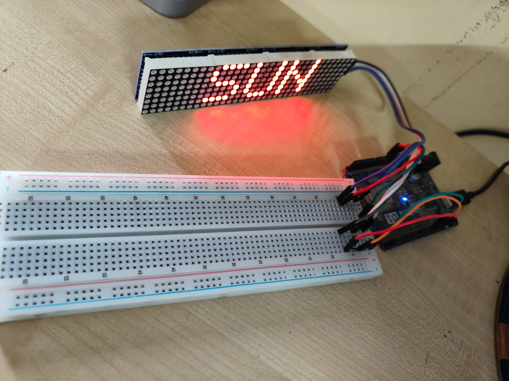
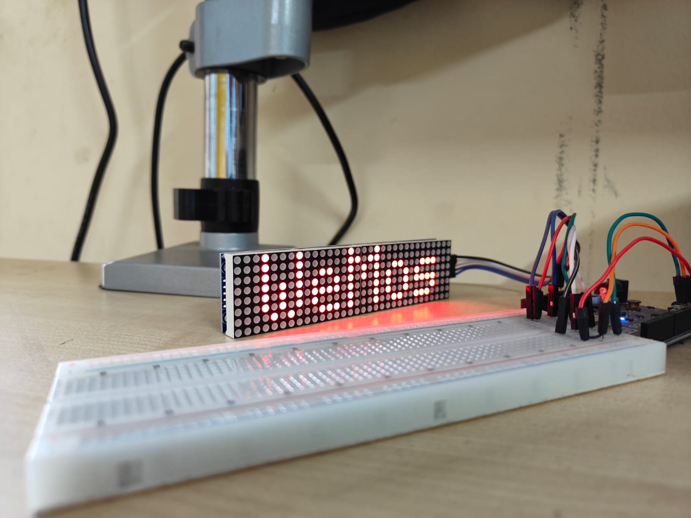
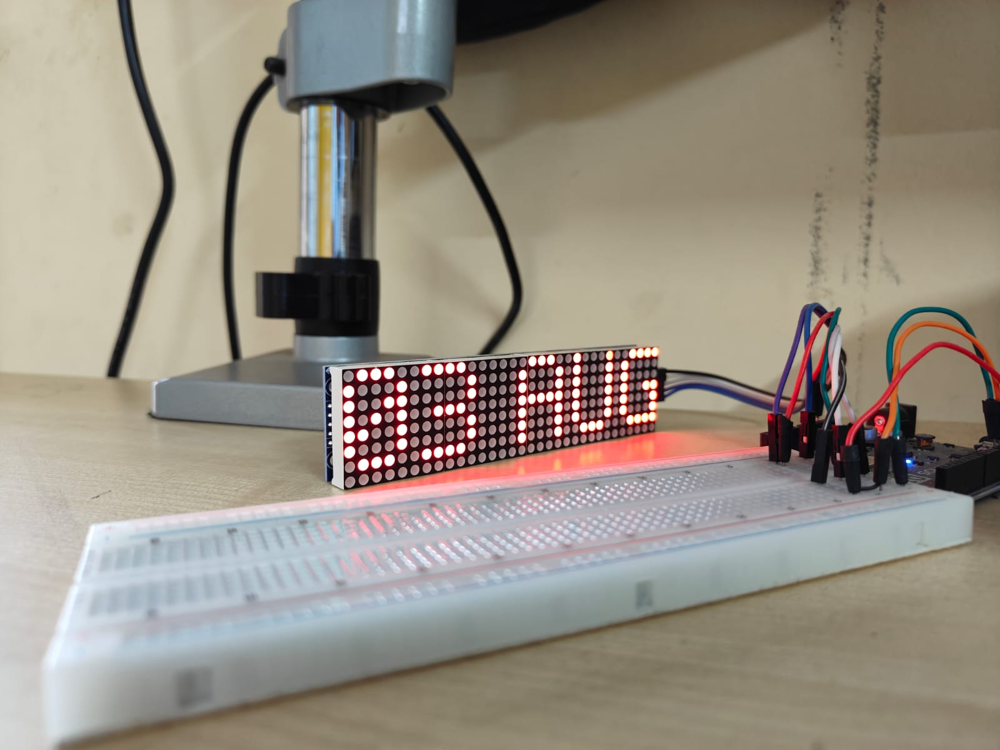
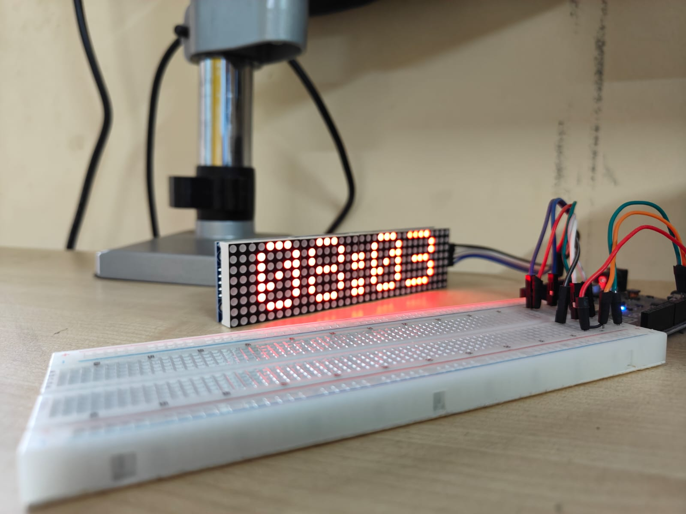
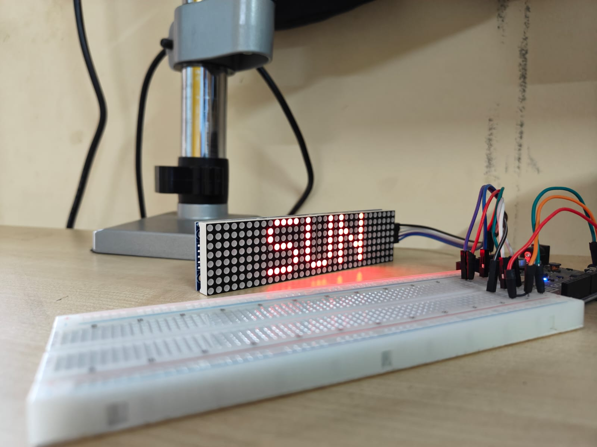
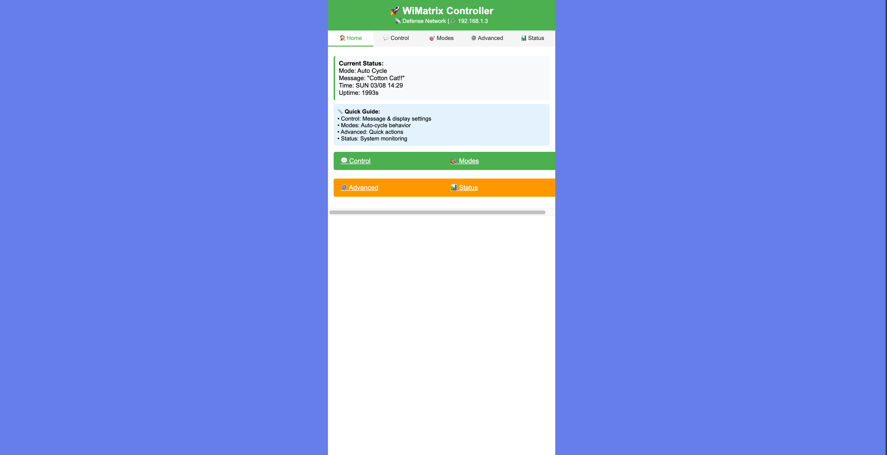
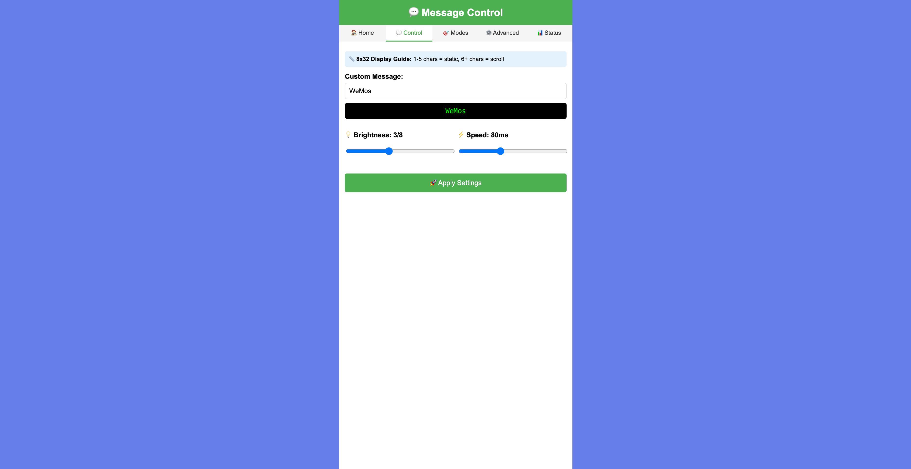
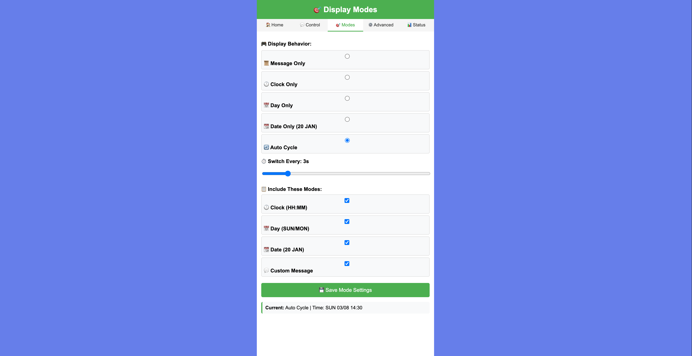
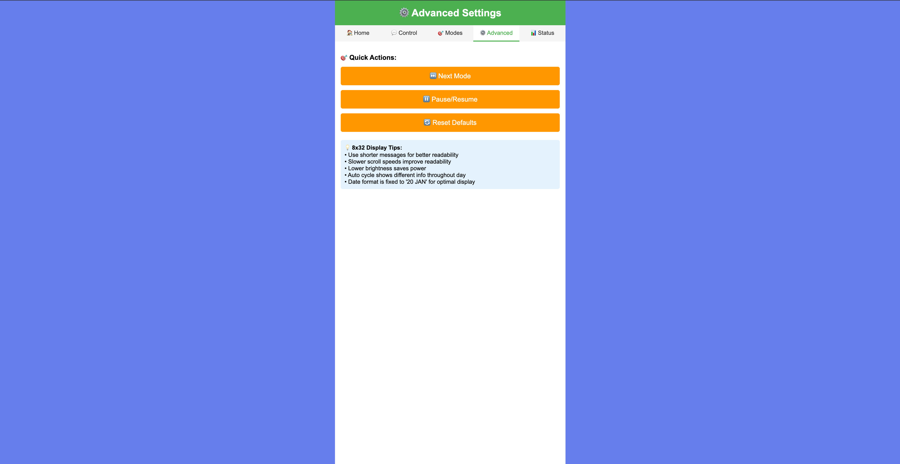
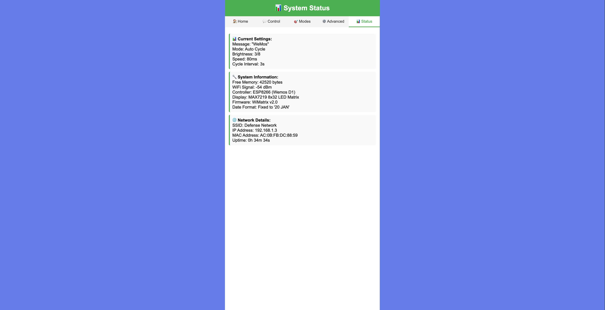

# WiMatrix

WiMatrix is a WiFi-enabled LED matrix display controller for ESP8266, featuring a multi-page web interface for real-time control, status monitoring, and customization. It supports various display modes (clock, date, day, message, auto-cycle), night mode dimming, and persistent settings.

## Features
- **Web Dashboard**: Control and monitor the display from any browser on your network.
- **Multiple Display Modes**: Switch between clock, date, day, custom message, or auto-cycle.
- **Settings Persistence**: All settings are retained across reboots.
- **API Endpoints**: Simple REST API for integration and automation.
- **Status Monitoring**: View WiFi, memory, uptime, and more.

## Hardware Requirements
- ESP8266-based board (e.g., NodeMCU, Wemos D1 Mini)
- MAX7219-based 8x32 LED matrix display
- SPI wiring (see `Config.h` for pin definitions)
```bash
WEMOS - LED Dot Matrix
-----------------------
5V    - VCC
GND   - GND
D7    - DIN
D6    - CS
D5    - CLK
```

## Getting Started

### 1. Clone the Repository
```
git clone git@github.com:tikarammardi/WiMatrix.git
cd WiMatrix
```

### 2. Configure WiFi and Hardware
Edit `include/Config.h` to set your WiFi credentials and hardware pin assignments.

### 3. Build and Upload
Use [PlatformIO](https://platformio.org/) or Arduino IDE:
- For PlatformIO:
  ```
  platformio run --target upload
  ```
- For Arduino IDE: Open `src/main.cpp` and upload to your ESP8266 board.

### 4. Access the Web Interface
- Connect the ESP8266 to power.
- Find its IP address in your router's admin page or serial monitor.
- Open a browser and go to `http://<device-ip>/`.

## Web Interface Pages
- `/` — Dashboard
- `/control` — Manual message and settings
- `/modes` — Enable/disable display modes
- `/advanced` — Advanced settings
- `/status` — System status

## API Endpoints
- `POST /api/next-mode` — Switch to next display mode
- `POST /api/pause-mode` — Pause/resume auto-cycling
- `POST /api/reset` — Reset settings to default
- `GET /api/settings` — Get current settings (JSON)
- `GET /api/current-time` — Get current time
- `GET /api/uptime` — Get uptime in seconds

## Customization
- Edit `include/Config.h` for hardware and WiFi settings.
- Edit `src/WebTemplates.cpp` for web UI customization.
- Edit `src/DisplayModeManager.cpp` to add or modify display modes.


## Credits
- [MD_Parola](https://github.com/MajicDesigns/MD_Parola) and [MD_MAX72xx](https://github.com/MajicDesigns/MD_MAX72XX) libraries by MajicDesigns
- ESP8266 Arduino Core

---
For questions or contributions, open an issue or pull request.

## Screenshots










